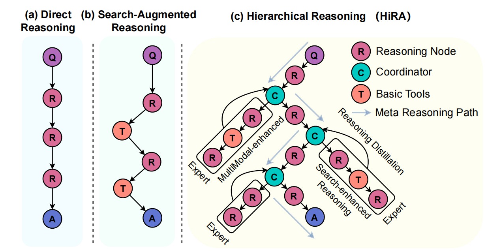
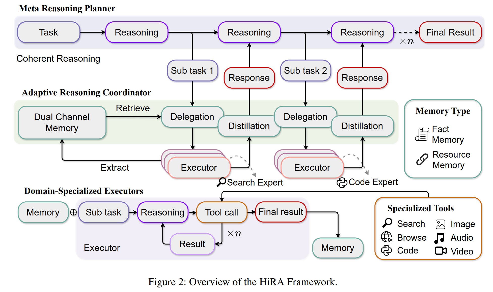
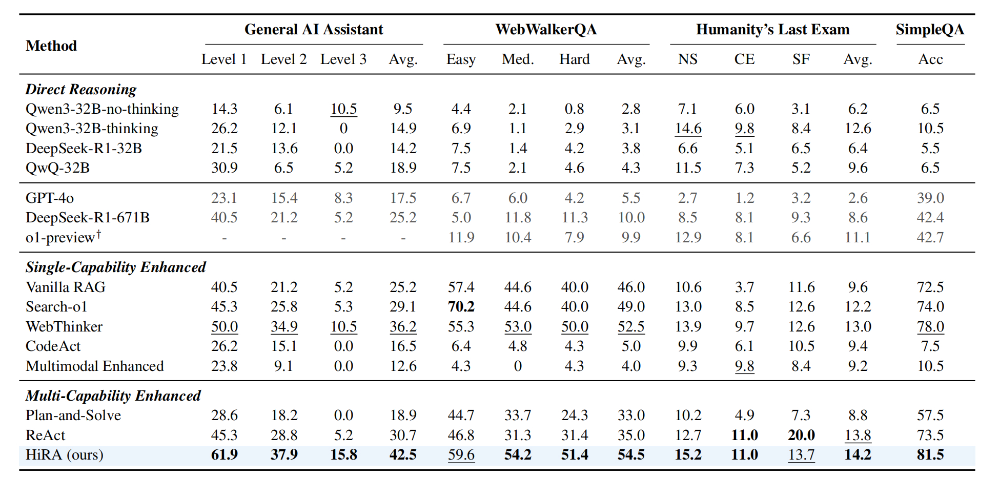
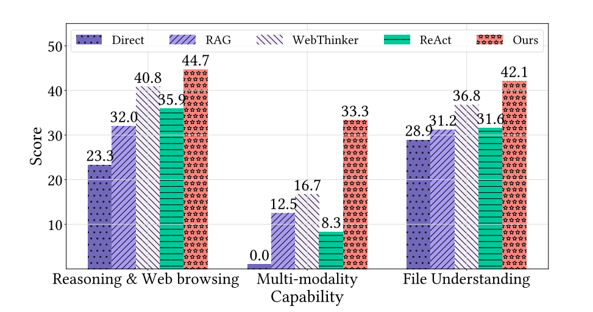

<h1 align="center"> 🧭 HiRA: Hierarchical Reasoning Framework for Deep Search</h1>

<div align="center">

[](assets/paper.pdf) [](LICENSE) [](https://www.python.org/)

</div>

<h5 align="center">⭐ If you find this project helpful, please star ⭐ the repo to support us!</h5>


---

## ✨ Key Features

✅ **Decoupled Planning & Execution:** Avoids reasoning contamination by separating high-level goals from low-level operations.  
✅ **Agentic Multi-Step Reasoning:** Modular agents for search, code execution, and multimodal understanding.  
✅ **Plug-and-Play Integration:** Add new tools and agents without retraining or brittle prompt engineering.  
✅ **Superior Performance:** Outperforms state-of-the-art RAG and agent-based systems across multiple benchmarks.

---

## 📝 To-Do List

- [ ] Train the Meta Planner to better understand and dispatch subtasks.
- [ ] Integrate more open-source Large Reasoning Models (LRMs) as the backbone for the Meta Planner and Expert Executors.
- [ ] Expand the variety of Domain-Specialized Executors, adding new tools for data analysis, image generation, etc.

---

## 💡 Motivation

Traditional retrieval-augmented generation (RAG) systems struggle with **complex, multi-step information needs** because they use a single reasoning model for both high-level planning and execution. This monolithic design leads to:
- Brittleness when integrating new tools.
- Reasoning disruption from noisy intermediate execution results.
- Poor scalability and adaptability for complex search tasks.

To address these challenges, **HiRA** introduces a **hierarchical reasoning architecture** that explicitly separates *planning* from *execution*, enabling expert agent collaboration for *deep search* and *complex reasoning*.


---

## 🏗️ Framework Overview

HiRA consists of **three main components**:

1️⃣ **Meta Reasoning Planner**  
- Decomposes complex tasks into subtasks.
- Generates high-level instructions for agents.  
- Ensures flexible, dynamic planning without direct tool invocation noise.

2️⃣ **Adaptive Reasoning Coordinator**  
- Selects the most suitable expert agent for each subtask.
- Supports bidirectional reasoning transfer and distillation.  
- Implements **dual-channel memory** for fact/resource sharing.

3️⃣ **Domain-Specialized Executors**  
- Handle subtask execution using specialized reasoning models and external tools.  
- Supports search, code execution, and multimodal analysis.

<p align="center">
  
</p>

---

## 🚀 Method

HiRA’s *agentic reasoning process* iteratively plans, delegates, and integrates subtask results:

- Meta Planner emits *subtask instructions*.
- Coordinator assigns these to appropriate expert agents.
- Agents execute subtasks, leveraging tools (search APIs, code interpreters, multimodal models).
- Coordinator distills results and updates memory.
- Planner integrates results, refines plan, and continues until the final answer is generated.

<p align="center">
  
</p>

---

## 📊 Performance

HiRA achieves **state-of-the-art results** across complex deep search tasks:

<p align="center">
  
</p>

HiRA consistently outperforms baselines, especially on complex tasks requiring:
- Long-horizon planning
- Information Seeking
- Multimodal integration
- Computational reasoning

<p align="center">
  
</p>

---

## 🛠️ Setup

### Requirements

- Python Version: 3.10 or higher
- Models: Local deployment of QwQ-32B and Qwen2.5-32B-Instruct models
- API Access: Qwen-Omni API (Alibaba Cloud Bailian Platform) or local deployment of Qwen2.5-Omni-7B

### Installation

```bash
git clone https://github.com/ignorejjj/hira.git
cd hira
pip install -r requirements.txt
```

### Model Deployment

Deploy the required models using VLLM with the following configurations:

```bash
vllm serve "model/QwQ-32B \
    --served-model-name "QwQ-32B" \
    --dtype "auto" \
    --tensor-parallel-size 4 \
    --gpu-memory-utilization 0.9 \
    --trust-remote-code \
    --uvicorn-log-level debug \
    --host 0.0.0.0 \
    --port 8000
```

```bash
vllm serve "model/Qwen2.5-32B-Instruct \
    --served-model-name "Qwen2.5-32B-Instruct" \
    --dtype "auto" \
    --tensor-parallel-size 4 \
    --gpu-memory-utilization 0.9 \
    --trust-remote-code \
    --uvicorn-log-level debug \
    --host 0.0.0.0 \
    --port 8001
```

## 🚀 Running Experiments

### Benchmark Evaluation

Execute experiments on standard benchmarks using the following command:

```bash
python src/run_meta.py \
    --dataset_name 'gaia' \
    --split 'dev' \
    --save_note "test_exp" \
    --use_single_dir \
    --save_dir "./results/" \
    --concurrent_limit 32 \
    --max_search_limit 15 \
    --bing_subscription_key "YOUR-BING-SUBSCRIPTION-KEY" \
    --api_base_url "http://0.0.0.0:8000/v1" \
    --model_name "QwQ-32B" \
    --aux_api_base_url "http://0.0.0.0:8001/v1" \
    --aux_model_name "Qwen2.5-32B-Instruct" \
    --omni_api_key 'YOUR-OMNI-API-KEY'
```

**Parameter Descriptions:**

- `--dataset_name` - Benchmark dataset name (e.g., 'gaia', 'mmlu', 'hotpotqa')
- `--split` - Dataset split to evaluate
- `--save_note` - Descriptive note for experiment identification
- `--save_dir` - Output directory path for results and logs
- `--concurrent_limit` - Maximum number of concurrent processing threads
- `--max_search_limit` - Maximum number of search operations per query
- `--bing_subscription_key` - Microsoft Bing Search API subscription key
- `--api_base_url` - Base URL for the main reasoning model API
- `--model_name` - Primary model name for meta planning
- `--aux_api_base_url` - Base URL for auxiliary model API
- `--aux_model_name` - Auxiliary model name for specialized tasks
- `--omni_api_key` - API key for multimodal model access

### Results Evaluation

After experiment completion, evaluate the results using:

```bash
python scripts/evaluate/evaluate.py \
    --output_path "result.json" \
    --use_llm \
    --api_base_url "http://0.0.0.0:8082/v1" \
    --model_name "Qwen2.5-72B-Instruct"
```

**Evaluation Parameters:**

- `--output_path` - Path to the results JSON file
- `--use_llm` - Enable LLM-based evaluation for complex answers
- `--api_base_url` - API endpoint for evaluation model
- `--model_name` - Model name for evaluation scoring

---

## 📄 Citation

If you use HiRA in your research, please cite our paper:

```bibtex
@article{hira2025,
  title={Decoupled Planning and Execution: A Hierarchical Reasoning Framework for Deep Search},
  author={Jiajie Jin, Xiaoxi Li, Guanting Dong, Yuyao Zhang, Yutao Zhu,Yang Zhao, Zhicheng Dou},
  journal={arXiv preprint},
  year={2025}
}
```

---

## 📞 Contact

For questions, feedback, or collaboration opportunities, please contact us at:
**Email:** jinjiajie@ruc.edu.cn

---

## 📄 License

This project is licensed under the MIT License. See the [LICENSE](LICENSE) file for details.